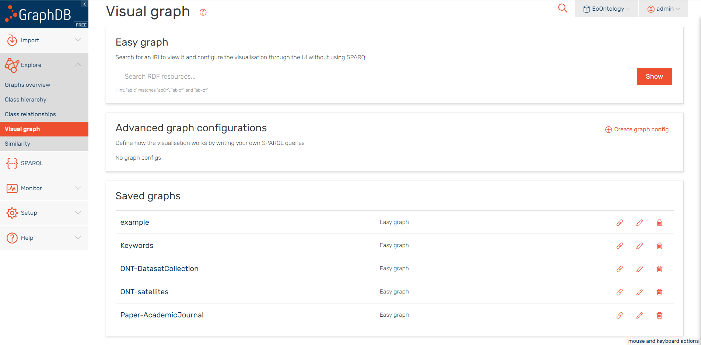

# EO Ontology

   

### We use GraphDB to store and visualize the OWL ontology. You can access our visual display interface online through [this link](http://39.107.247.167:7200/graphs-visualizations?saved=95e57c0b46464169988c5a1af57de6cd):
 

### 5 dynamic interactive graphs have been generated in the database, and you can directly use them through "Visual Graph->Saved graphs". You can also query our database through SPARQL language to get the data and diagrams you need:

 

